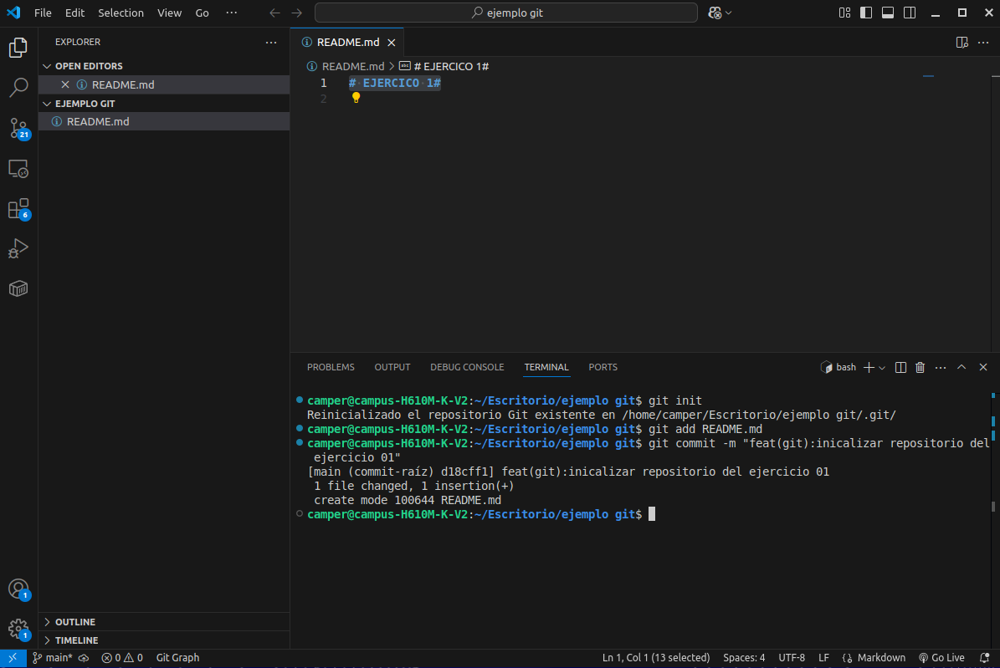

# Solución: Inicializar repo de equipo esports (Shooters) 🎮

**Estudiante:** Stefani Sánchez  
**Contexto de la simulación:** Configuración inicial del repositorio de estrategia para una escuadra de shooters tácticos (Viper Strike Esports).

---

## 1. Explicación del razonamiento

Para resolver este ejercicio con un enfoque profesional y colaborativo, estructuré la solución bajo la siguiente lógica:

* **Aislamiento del entorno:** Creé un directorio local llamado `ejemplo git` en el Escritorio de mi sistema de manera externa, garantizando no alterar los archivos base del repositorio principal del curso.
* **Creación del archivo central:** Generé el archivo `README.md` agregando una estructura de título inicial (`# EJERCICO 1#`) directo en el editor para simular la documentación de la escuadra.
* **Control de versiones ordenado:** Utilicé la terminal integrada para inicializar el repositorio (`git init`), rastrear el archivo (`git add`) y finalmente congelar el estado con un commit descriptivo bajo el estándar de buenas prácticas.

---

## 2. Solución completa y comandos ejecutados

A continuación se documenta la secuencia exacta de comandos aplicados en la terminal, los cuales coinciden fielmente con los registros de la pantalla en mi archivo de captura:

### Paso 1: Inicialización del repositorio
Activación del control de versiones en la carpeta del proyecto de videojuegos:
```bash
git init
```

